# Features

## Remove promoted content
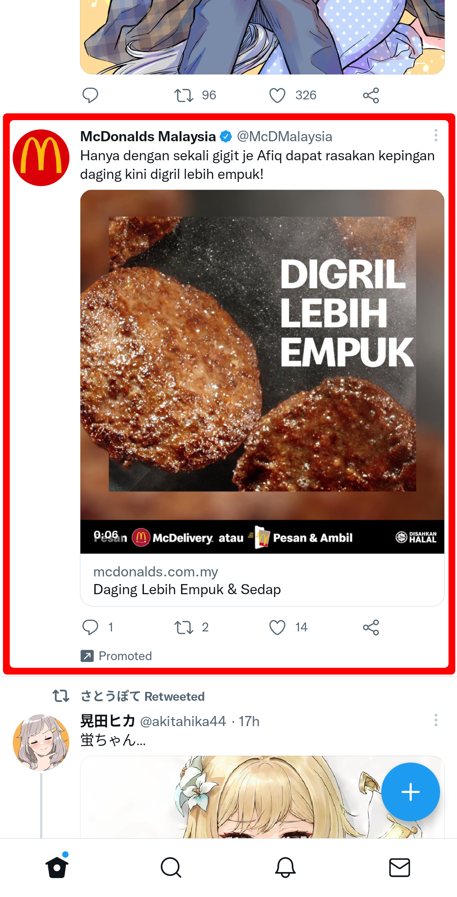

## Remove promoted users
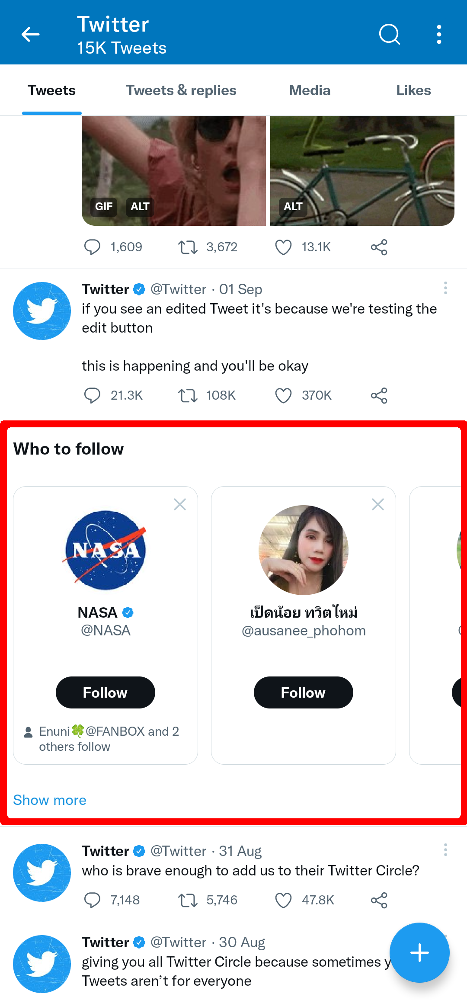 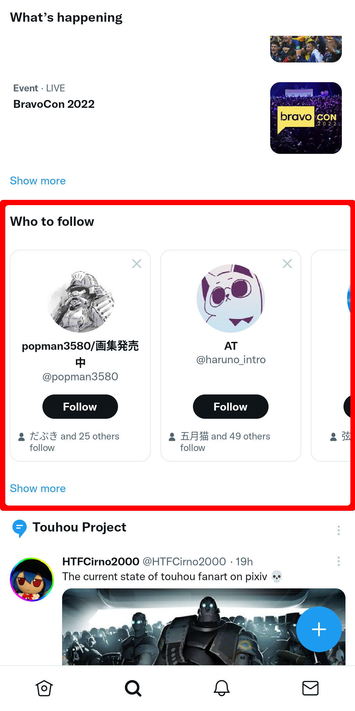

## Remove promoted trends
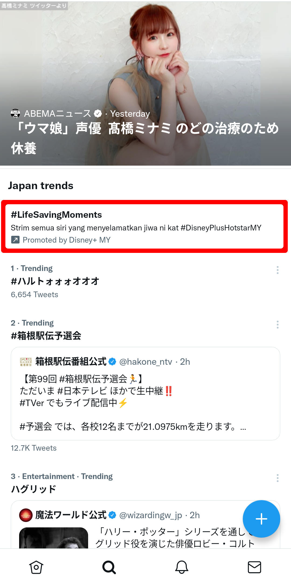

## Remove sensitive media warning
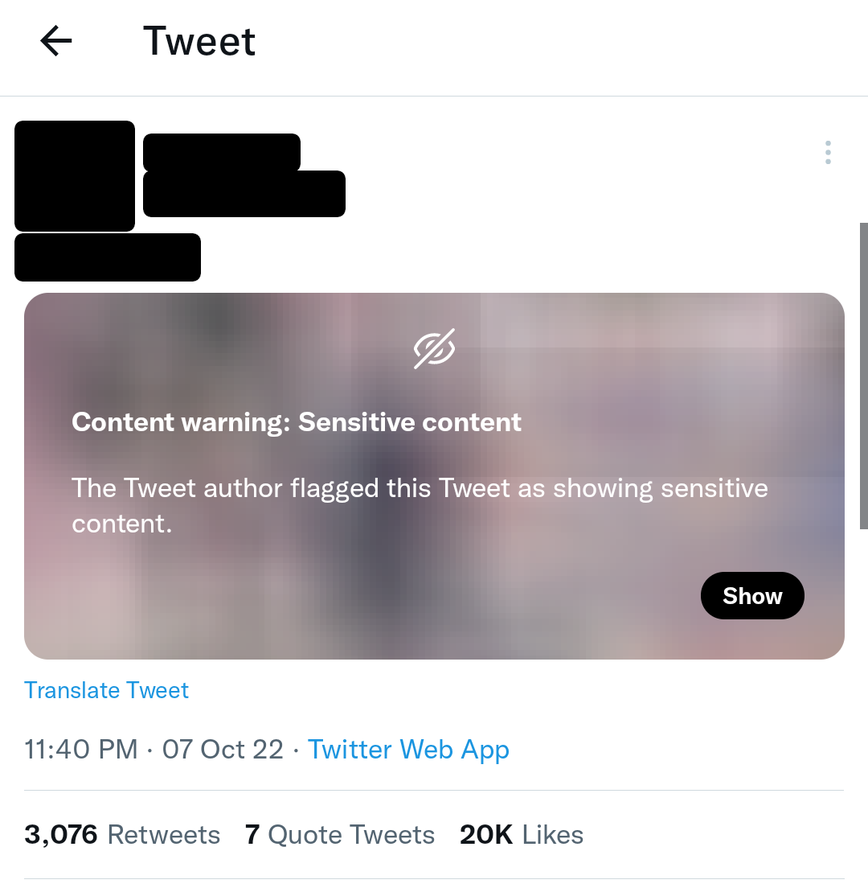

## Disable recommended users
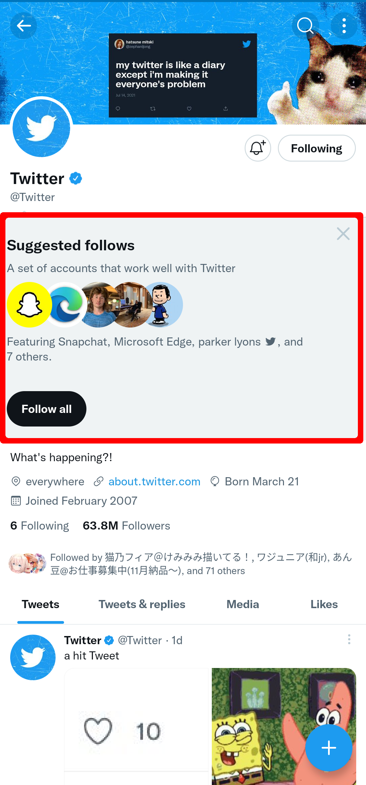

## Copyable alt text
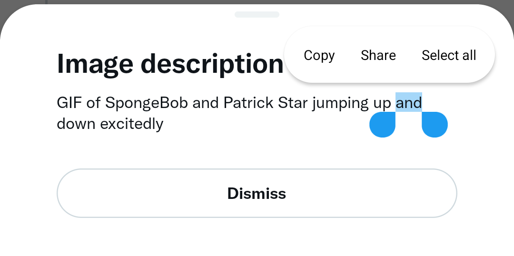

## Download media menu
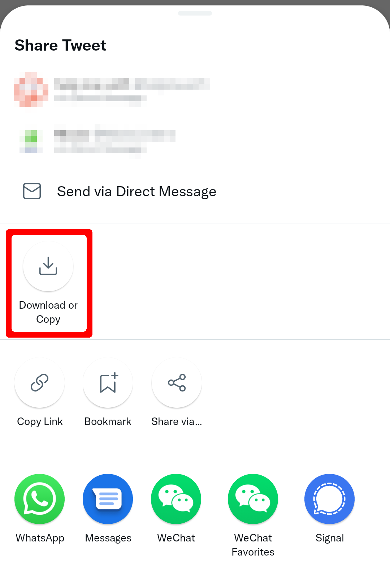 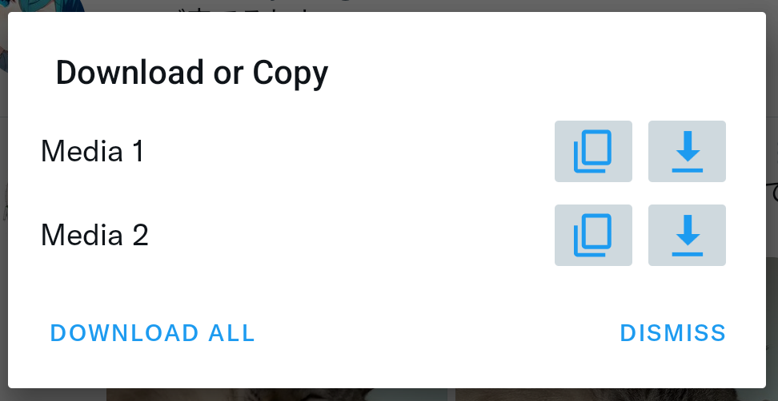

## Hide drawer items
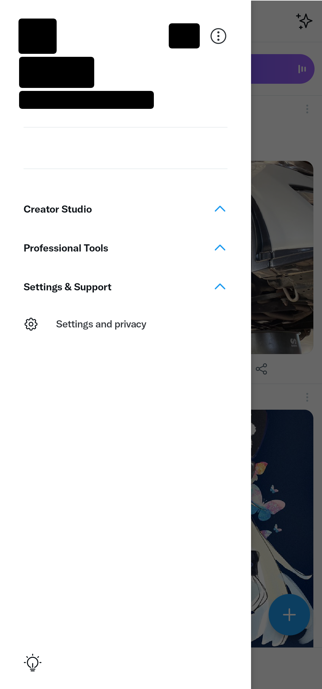

Slightly broken due to Twitter new drawer layout.

## Hide navigation bar items
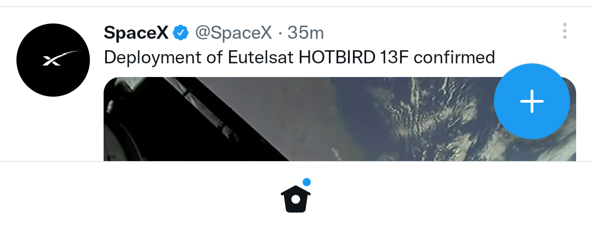

## Disable url redirect
Prevent Twitter redirect from `t.co` to target link when clicking on a link in Twitter.

## Disable Threads (live content)
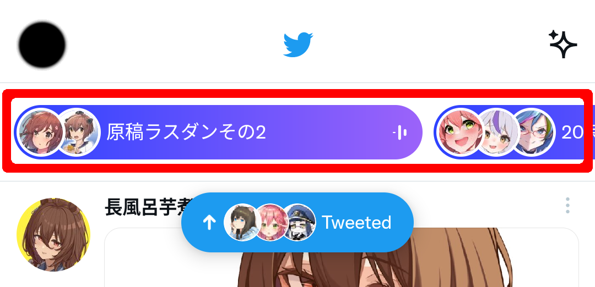

## Disable Tweet Detail Related Tweets
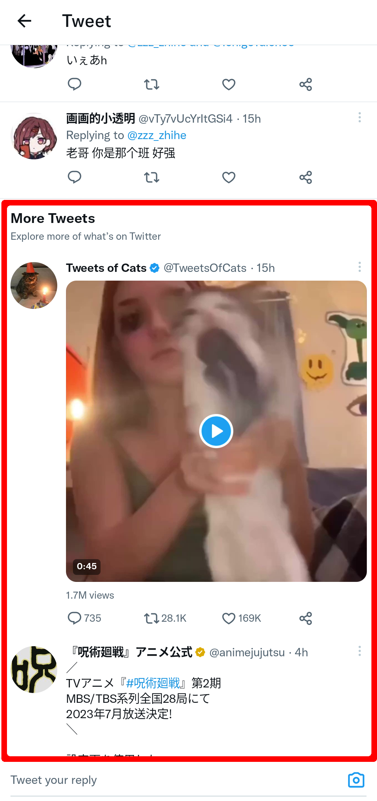

## Remove video carousel
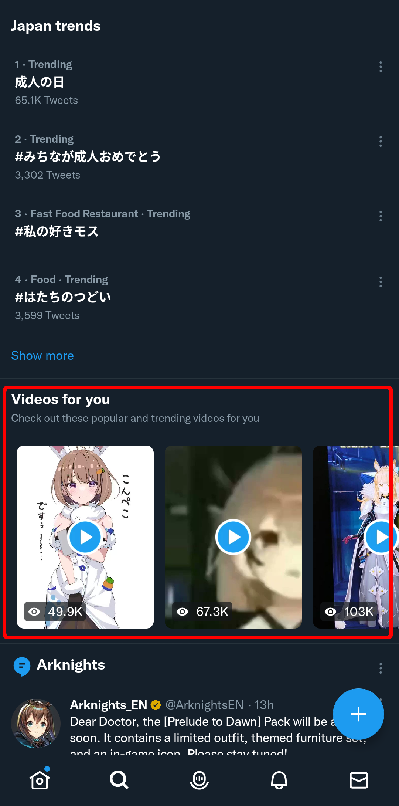

## Feature switch
Force enable/disable Twitter experimental feature.
