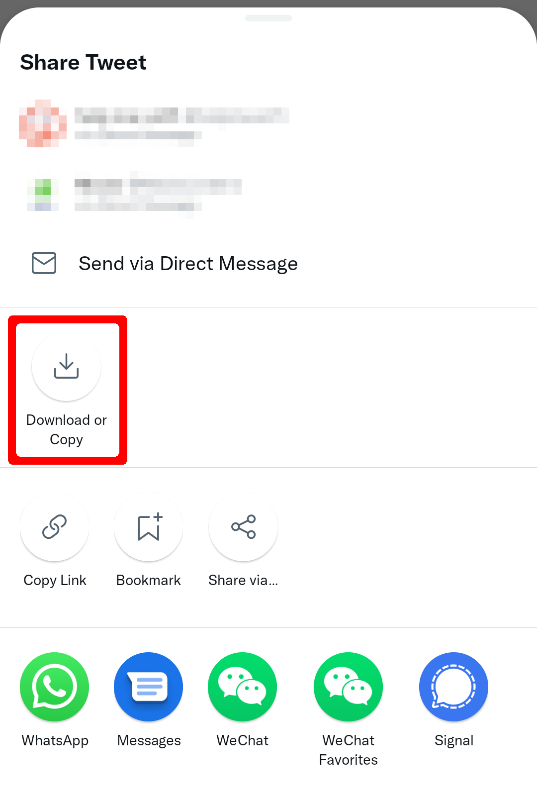

    

<h1 align="center">TwiFucker</h1>

### Yet Another Adkiller for Twitter
    
[![author][author-image]][author-url]
[![release][release-image]][release-url]
[![last commit][last-commit-image]][last-commit-url]    
    
English &nbsp;&nbsp;|&nbsp;&nbsp; [Indonesia](README_IN.md) &nbsp;&nbsp;|&nbsp;&nbsp; [日本語](README_JA.md)
    
##

⚠️ This is an Xposed module. Support only API 93+ ⚠️ 

You can find Beta version / Rootless integration (automatically embed latest Twitter with [LSPatch](https://github.com/LSPosed/LSPatch)) at our Telegram channel
    
[author-image]: https://img.shields.io/badge/author-Nullptr-blue.svg
[author-url]: https://github.com/Dr-TSNG

[release-image]: https://img.shields.io/github/v/release/Dr-TSNG/TwiFucker?color=blue
[release-url]: https://github.com/Dr-TSNG/TwiFucker/releases/latest
   
[last-commit-image]: https://img.shields.io/github/last-commit/Dr-TSNG/TwiFucker?label=last%20commit
[last-commit-url]: https://github.com/Dr-TSNG/TwiFucker/commits

##

   
<h2>✨ Features</h2>

    
## Remove promoted content

## Remove promoted users
 

## Remove promoted trends

## Remove sensitive media warning

## Disable recommended users

## Copyable alt text

## Download media menu
 

## Hide drawer items

Slightly broken due to Twitter new drawer layout.

## Hide navigation bar items

## Disable url redirect
Prevent Twitter redirect from `t.co` to target link when clicking on a link in Twitter.

## Disable Threads (live content)

## Disable Tweet Detail Related Tweets

## Remove video carousel

## Feature switch
Force enable/disable Twitter experimental feature.

## Disable banner view

    

## 🛠️ Usage

- Long tap Twitter logo at top of the Twitter home screen OR
- `Settings and privacy` > `Additional resources` > Tap version

## 🚀 Stargazers over time

