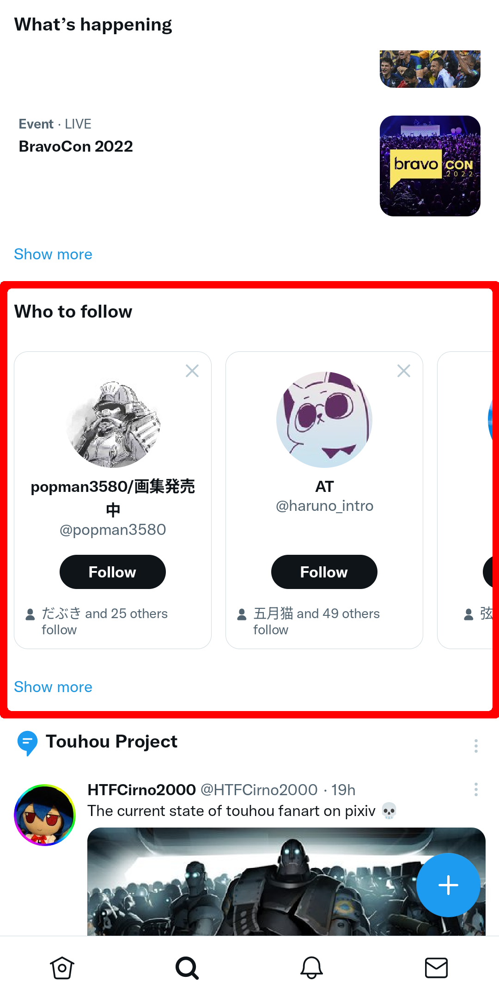

    

<h1 align="center">TwiFucker</h1>

### Adkiller Lainnya untuk Twitter
    
[![author][author-image]][author-url]
[![release][release-image]][release-url]
[![last commit][last-commit-image]][last-commit-url]    
    
[Inggris](README.md) &nbsp;&nbsp;|&nbsp;&nbsp; Indonesia &nbsp;&nbsp;|&nbsp;&nbsp; [简体中文](README_ZH-CN.md) &nbsp;&nbsp;|&nbsp;&nbsp; [繁體中文](README_ZH-TW.md) &nbsp;&nbsp;|&nbsp;&nbsp; [日本語](README_JA.md)
    
##

⚠️ Ini adalah modul Xposed. Dukungan hanya untuk API 93+ ⚠️ 

Anda dapat menemukan versi Beta / Integrasi Tanpa Root (secara otomatis menyematkan Twitter terbaru dengan [LSPatch](https://github.com/LSPosed/LSPatch)) di saluran Telegram kami.
    
[author-image]: https://img.shields.io/badge/author-Nullptr-blue.svg
[author-url]: https://github.com/Dr-TSNG

[release-image]: https://img.shields.io/github/v/release/Dr-TSNG/TwiFucker?color=blue
[release-url]: https://github.com/Dr-TSNG/TwiFucker/releases/latest
   
[last-commit-image]: https://img.shields.io/github/last-commit/Dr-TSNG/TwiFucker?label=last%20commit
[last-commit-url]: https://github.com/Dr-TSNG/TwiFucker/commits

##

   
<h2>✨ Fitur</h2>

    
## Menghapus konten yang dipromosikan

## Menghapus pengguna yang dipromosikan
 

## Menghapus tren yang dipromosikan

## Menghapus peringatan media sensitif

## Menonaktifkan pengguna yang direkomendasikan

## Teks alt yang dapat disalin

## Menu unduh media
 

## Menyembun
