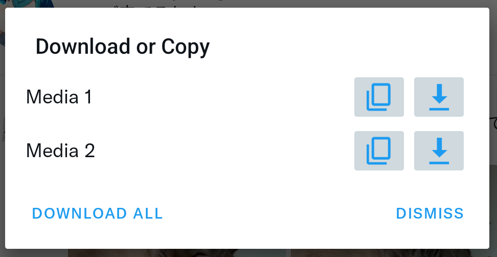
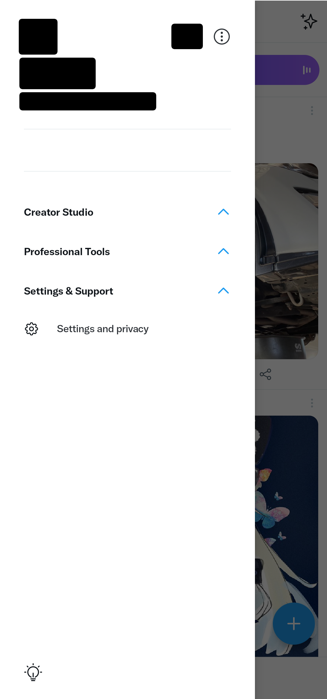
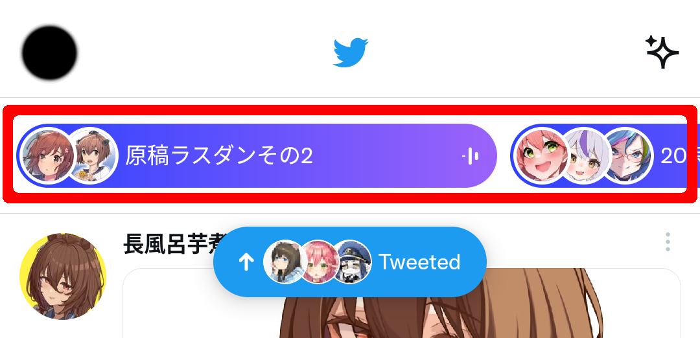

    

<h1 align="center">TwiFucker</h1>

### Twitter の新たなる広告キラーアプリ
    
[![author][author-image]][author-url]
[![release][release-image]][release-url]
[![last commit][last-commit-image]][last-commit-url]    
    
[English](README.md) &nbsp;&nbsp;|&nbsp;&nbsp; [Indonesia](README_IN.md) &nbsp;&nbsp;|&nbsp;&nbsp; 日本語
    
##

⚠️このアプリは Xposed モジュールです。API 93以降のみ対応をしています ⚠️

Beta 版または非root向け統合版はこちらで探せます。 (Telegram のチャンネルで最新版の Twitter アプリに[LSPatch](https://github.com/LSPosed/LSPatch)で自動的にパッチをした物がダウンロード可能です)
    
[author-image]: https://img.shields.io/badge/author-Nullptr-blue.svg
[author-url]: https://github.com/Dr-TSNG

[release-image]: https://img.shields.io/github/v/release/Dr-TSNG/TwiFucker?color=blue
[release-url]: https://github.com/Dr-TSNG/TwiFucker/releases/latest
   
[last-commit-image]: https://img.shields.io/github/last-commit/Dr-TSNG/TwiFucker?label=last%20commit
[last-commit-url]: https://github.com/Dr-TSNG/TwiFucker/commits

##

   
<h2>✨ 特徴</h2>

## プロモーションコンテンツの削除

## プロモーションユーザーの削除
 

## プロモーショントレンドを削除

## センシティブなメディアの警告を無効化

## おすすめユーザーを無効化

## コピー可能な代替テキスト

## メディアのダウンロードメニュー
 

## ドロワーの項目を非表示

Twitter の新しいドロワーレイアウトの影響で崩れる場合があります

## ナビゲーションバーの項目を非表示

## URLのリダイレクトを無効化
Twitter でリンクを開いた際に「t.co」からターゲットリンクにリダイレクトをさせないようにします

## スレッドを表示を無効化 (ライブコンテンツ)

## ツイート詳細の関連ツイートを無効化

## 動画カルーセルを削除

## 機能スイッチ
Twitter の実験的な機能の強制的な有効化/無効化

## バナー表示を無効にする

  

## 🛠️ 使い方

- Twitter ホーム画面の上部にある Twitter のロゴを長押しするか、
- `設定とプライバシー` > `その他のリソース` > バージョンをタップする

## 🚀 スターガザーの推移

