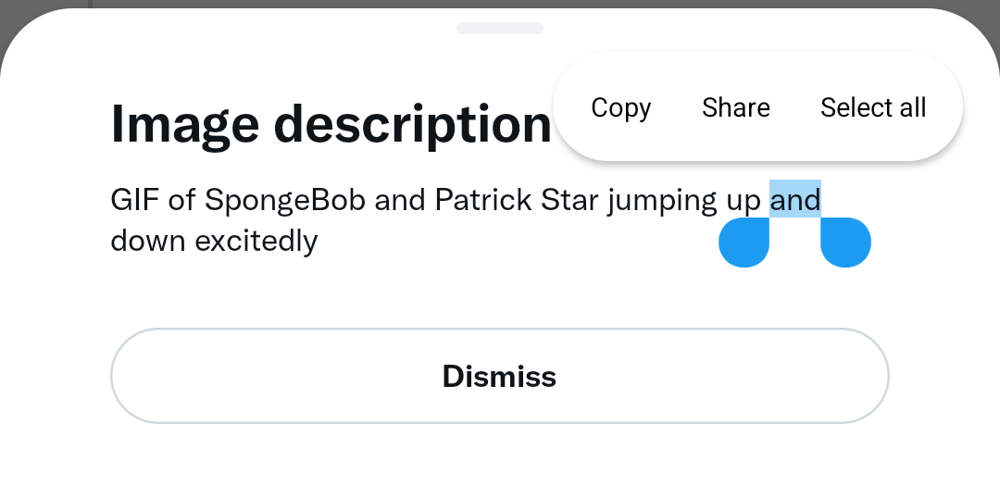
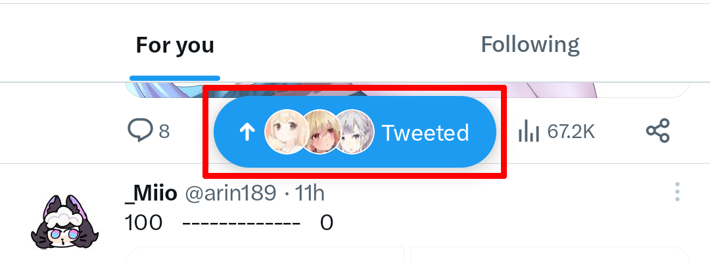

    

<h1 align="center">TwiFucker</h1>

### 又一个用于屏蔽 Twitter 广告的工具
    
[![作者][作者图像]][作者链接]
[![发布版本][发布版本图像]][发布版本链接]
[![最近提交][最近提交图像]][最近提交链接]    
    
[English](README.md) &nbsp;&nbsp;|&nbsp;&nbsp; [Indonesia](README_IN.md) &nbsp;&nbsp;|&nbsp;&nbsp; 简体中文 &nbsp;&nbsp;|&nbsp;&nbsp; [繁體中文](README_ZH-TW.md) &nbsp;&nbsp;|&nbsp;&nbsp; [日本語](README_JA.md)
    
##

⚠️ 这是一个 Xposed 模块，仅支持 API 93+ ⚠️ 

你可以在我们的 Telegram 频道中找到 Beta 版本 / 无需 Root 的集成（自动集成最新的 Twitter，使用 [LSPatch](https://github.com/LSPosed/LSPatch)）

[作者图像]: https://img.shields.io/badge/作者-Nullptr-blue.svg
[作者链接]: https://github.com/Dr-TSNG

[发布版本图像]: https://img.shields.io/github/v/release/Dr-TSNG/TwiFucker?color=blue
[发布版本链接]: https://github.com/Dr-TSNG/TwiFucker/releases/latest
   
[最近提交图像]: https://img.shields.io/github/last-commit/Dr-TSNG/TwiFucker?label=最近提交
[最近提交链接]: https://github.com/Dr-TSNG/TwiFucker/commits

##

   
<h2>✨ 功能</h2>

    
## 移除推广内容

## 移除推广用户
 

## 移除推广趋势

## 移除敏感媒体警告

## 禁用推荐用户

## 可复制的替代文本

## 下载媒体菜单
 

## 隐藏抽屉项目

由于 Twitter 的新抽屉布局，此功能可能存在一些问题。

## 隐藏导航栏项目

## 禁用 URL 重定向
防止在 Twitter 中点击链接时从 `t.co` 重定向到目标链接。

## 禁用主题（实时内容）

## 禁用推文详情相关推文

## 移除视频轮播

## 功能开关
强制启用/禁用 Twitter 实验功能。

## 禁用横幅视图

    

## 🛠️ 使用方法

- 在 Twitter 主页顶部长按 Twitter 图标，或者
- 进入 `设置和隐私` > `其他资源` > 点击版本号

## 🚀 Star 趋势图

